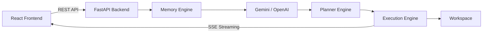

# CodeForge AI

An autonomous software engineering platform that combines planning, workspace automation, and LLM-powered assistance through a FastAPI backend and a React frontend.

[](https://www.python.org/)
[](https://fastapi.tiangolo.com/)
[](https://react.dev/)
[](https://www.typescriptlang.org/)
[](https://mui.com/)
[](https://www.docker.com/)
[](https://deepmind.google/technologies/gemini/)
[](https://openai.com/)
[](https://developer.mozilla.org/en-US/docs/Web/API/Server-sent_events)

## Project Overview

CodeForge AI automates software tasks by planning, executing, and validating local filesystem changes using autonomous ReAct agent loops. Standard development workflows require developers to copy and paste code manually between editors and LLM interfaces; this platform integrates these steps into a sandboxed local workspace.

The system is designed for automating directory modifications, test configurations, and boilerplate setups. It serves as a portfolio project showcasing decoupled agent routing, vector context queries, and Server-Sent Events (SSE) telemetry.

## Quick Start

### Backend
```bash
cd backend
python -m venv venv

# Windows
venv\Scripts\activate

# macOS/Linux
source venv/bin/activate

pip install -r requirements.txt
uvicorn app.main:app --reload
```

### Frontend
```bash
cd frontend
npm install
npm run dev
```

## Why CodeForge AI?

Traditional AI coding assistants primarily generate code from prompts but provide limited visibility into planning, execution, workspace operations, and intermediate reasoning.

CodeForge AI explores an agent-oriented software engineering workflow where planning, execution, workspace automation, memory retrieval, and real-time streaming are integrated into a single developer interface.

## Project Summary

| Category | Value |
|----------|-------|
| Architecture | FastAPI + React |
| Frontend | React 18 + TypeScript + Material UI |
| Backend | FastAPI + Python |
| AI Providers | Google Gemini, OpenAI |
| Streaming | Server-Sent Events (SSE) |
| Planning | ReAct Agent Loop |
| Workspace | Local Sandboxed Filesystem |
| Testing | 169 Backend Tests |

## Features

### Execution Planner

Decomposes objectives into structured task configurations, ordering tasks sequentially or hierarchically based on dependency constraints before launching agent executions.

**Key capabilities**

*   Generates plans with Sequential or Hierarchical strategies.
*   Validates task hierarchies and cyclic dependencies using schema models.
*   Saves validated plans into memory databases for future runs.

### Interactive Chat

Provides a conversational assistant interface that executes file operations directly within the local workspace environment.

**Key capabilities**

*   Streams token outputs in real-time via Server-Sent Events (SSE).
*   Retrieves context parameters (recent executions and logs) automatically.
*   Modifies files in the workspace based on user questions.

### Workspace Explorer

Provides a directory explorer, file creator, and inline editor panel restricted to the workspace folder.

**Key capabilities**

*   Lists files recursively and displays local git status tracking tags.
*   Supports inline file creation, modification, and deletion.
*   Scaffolds directory boilerplates (FastAPI, Flask, CLI packages).

### Memory Inspector

Queries, filters, and clears stored vector memory records containing task outputs and history logs.

**Key capabilities**

*   Calculates keyword matching scores to retrieve relevant contextual logs.
*   Provides inspect dialogs showing raw memory logs, tags, and parameters metadata.
*   Allows wiping the database to clean up disk assets.

### Metrics Telemetry

Monitors host metrics, active executions, LLM completions counters, and process memory footprints.

**Key capabilities**

*   Tracks process RSS memory usage allocations.
*   Calculates success rates, average runtimes, and active task queues.
*   Displays completions percentages grouped by model providers.

## System Capabilities

| Capability | Description |
|------------|-------------|
| **Planning** | Decomposes high-level text objectives into JSON-validated task dependency graphs. |
| **Workspace Management** | Performs recursive directory queries, text modifications, and project template scaffolding. |
| **Streaming** | Publishes real-time logs, ReAct loop decisions, and chat tokens using SSE unidirectional connections. |
| **Memory** | Indexes, retrieves, and clears local metadata JSON records using similarity matching. |
| **Telemetry** | Monitors process RSS memory allocations, uptime, error registries, and provider usage stats. |
| **LLM Providers** | Interfaces with model provider APIs via decoupled client adapters (Gemini, OpenAI). |

## Screenshots

### Dashboard
Do not invent image names.

### Chat
Do not invent image names.

### Workspace
Do not invent image names.

### Memory
Do not invent image names.

### Metrics
Do not invent image names.

## Demo

This project currently does not have a public deployment because it requires local filesystem access and API keys for LLM providers.

Demo assets to be added:

*   Application walkthrough video
*   End-to-end execution demo
*   Feature showcase GIFs

## Key Technical Contributions

*   Designed an asynchronous SSE streaming pipeline to deliver real-time agent reasoning and LLM responses without polling.
*   Implemented provider adapters that isolate Gemini and OpenAI SDK logic behind a common abstraction.
*   Built a sandboxed workspace layer that restricts filesystem operations to the configured workspace directory.
*   Developed planner validation logic that prevents invalid dependency graphs before execution.
*   Created a lightweight memory registry that stores and retrieves previous execution context.
*   Implemented a React dashboard using Material UI to visualize execution state, workspace data and telemetry.

## Personal Contributions

This project was designed and implemented as a software engineering portfolio project.

Major implementation work includes:

*   FastAPI backend architecture
*   React + TypeScript frontend
*   Server-Sent Events (SSE) streaming
*   Workspace management APIs
*   Planner implementation
*   LLM provider abstraction
*   Memory engine integration
*   Dashboard and telemetry interface
*   Testing and debugging

## Architecture Highlights

*   **FastAPI & React Separation:** The backend handles API gateway requests, tool execution, and LLM orchestration, while the React frontend manages component states, Axios requests, and event stream connections. This decoupling ensures independent scaling and simplifies UI updates.
*   **Provider Abstraction:** CodeForge AI leverages an abstract `BaseLLMProvider` class. Specific implementations (`GeminiProvider` and `OpenAIProvider`) translate exceptions and map settings, allowing switching engines without modifying downstream code. This allows additional providers to be added without changing application logic.
*   **Planner Engine:** The planner converts high-level engineering goals into structured execution steps before passing them to the execution engine. This ensures the agent works on clear, validated sub-tasks instead of parsing raw prompts.
*   **Filesystem Sandboxing:** Tool executions are restricted to the `/workspace` folder, ensuring directory integrity and avoiding unauthorized path-traversal commands. This protects the host files and limits tool scope.
*   **Centralized Telemetry:** A telemetry tracker records active/completed runs and CPU/memory allocations, exposing system telemetry metrics to the UI. This provides developers with real-time insight into performance bottlenecks.

## Key Technical Concepts

*   **Autonomous ReAct Agent Workflow:** Combines reasoning step execution with localized action loops (thoughts, tool actions, and raw observations).
*   **Server-Sent Events (SSE):** Real-time backend-to-client telemetry publishing over persistent HTTP.
*   **Provider Abstraction Pattern:** Decouples core service business logic from specific API SDK bindings via interchangeable provider classes.
*   **RESTful API Design:** Modular router structures, Pydantic data schemas validation, and standardized JSON error formatting.
*   **Async Programming with FastAPI:** Non-blocking handling of SSE streams and asynchronous tool executions.
*   **Workspace Sandboxing:** Directory-scoped path resolution restricting file accesses and commands to a sandbox folder.
*   **Memory-Based Context Retrieval:** Vector metadata queries to inject previous task and chat histories as context.
*   **Dependency Injection:** Clean software design decoupling service instances and request context dependencies.

## System Workflow



1.  **Request Initiation:** The user inputs a goal or prompt in the React frontend.
2.  **Plan Generation:** The FastAPI backend receives the request, gathers relevant history from the Memory Engine, and queries the LLM to get a structured execution plan.
3.  **Task Execution:** The backend spawns a ReAct loop. The agent queries tools (filesystem write/read, command execution) to fulfill the plan tasks.
4.  **Real-Time Feedback:** Tool results, actions, and agent thoughts are published via an SSE stream and rendered on the frontend console.
5.  **Persistence:** The final execution trace is saved to memory, and the telemetry dashboard updates stats.

### Data Flow Summary

*   **Frontend:** Accepts goal inputs, routes paths, and reads SSE streams to render agent steps.
*   **Backend:** Handles REST router validations, compiles metrics, and coordinates LLM providers.
*   **Planner:** Formulates goal prompts, parses responses, and enforces topological plan ordering.
*   **Tools:** Runs filesystem reads/writes and shell command scripts within the sandboxed directory.
*   **Memory:** Saves executions data and conversation logs, retrieving similarity contexts on new runs.

## API Overview

| Endpoint | Method | Purpose |
|----------|--------|---------|
| /api/v1/chat | POST | Streams chat responses and agent output through Server-Sent Events |
| /api/v1/planner | POST | Generates structured execution plans |
| /api/v1/workspace | GET / POST | Reads, writes, edits and scaffolds workspace files |
| /api/v1/memory | GET / POST / DELETE | Searches, stores and clears memory entries |
| /api/v1/metrics | GET | Returns runtime telemetry and execution statistics |
| /api/v1/settings | GET / POST | Reads and updates application configuration |
| /api/v1/health | GET | Health check endpoint |

## Tech Stack

| Layer | Technologies |
|-------|--------------|
| **Frontend** | React 18, TypeScript, Material UI (MUI) v9, Emotion, Axios, Vite, React Router DOM, Lucide Icons |
| **Backend** | FastAPI, Uvicorn, Pydantic v2, Pydantic Settings, Python-dotenv, aiofiles |
| **AI Integration** | Google Generative AI (Gemini SDK), OpenAI SDK |
| **Testing** | Pytest, Pytest-Asyncio, HTTPX |
| **DevOps & Infrastructure** | Docker, Docker Compose, Git |

## Project Structure

```
.
├── backend/
│   ├── app/
│   │   ├── api/             # Handles REST API endpoint routing and dependency providers.
│   │   ├── chat/            # Manages chat histories and token stream generation.
│   │   ├── core/            # Configures global settings and rotating file logging.
│   │   ├── llm/             # Manages LLM model clients, providers, and API exceptions.
│   │   ├── memory/          # Controls memory storage indexes and similarity search tools.
│   │   ├── planner/         # Handles task decomposition strategies and plan validations.
│   │   ├── services/        # Orchestrates the execution loops and service processes.
│   │   ├── tools/           # Declares filesystem tools and terminal command utilities.
│   │   ├── workspace/       # Restricts and maps target folder operations.
│   │   └── main.py          # Serves as the FastAPI application entrypoint.
│   ├── tests/               # Houses backend unit and integration pytest modules.
│   ├── Dockerfile           # Builds backend container environments.
│   └── requirements.txt     # Declares Python package dependencies.
├── frontend/
│   ├── src/
│   │   ├── components/      # Contains reusable layout UI components.
│   │   ├── layouts/         # Controls dashboard drawer and nav frames.
│   │   ├── pages/           # Defines route view pages (Dashboard, Workspace, Memory, Settings).
│   │   ├── services/        # Connects Axios requests to backend API groups.
│   │   ├── App.tsx          # Defines the React Router paths.
│   │   ├── main.tsx         # Mounts the React node to the DOM.
│   │   └── theme.ts         # Declares Material UI theme colors.
│   ├── Dockerfile           # Builds frontend container images.
│   ├── package.json         # Declares JavaScript node packages.
│   └── vite.config.ts       # Configures local dev proxies and server ports.
├── workspace/               # Local folder playground for agent edits.
├── docker-compose.yml       # Orchestrates frontend and backend container builds.
└── README.md                # Documentation overview of the repository.
```

### Top-Level Folders

| Folder | Purpose |
|--------|---------|
| `backend` | FastAPI application source code, API endpoints, LLM client adapters, and unit test suites. |
| `frontend` | React frontend application, Material UI layouts, components, API client services, and Vite dev configurations. |
| `workspace` | Sandboxed local playground directory where the agent reads, writes, and executes filesystem operations. |

## Environment Variables

To configure local database variables and API bindings, duplicate `.env.example` to create a `.env` file in the root directory:

```bash
cp .env.example .env
```

Define placeholder configuration credentials as follows:
```env
HOST=0.0.0.0
PORT=8000
LLM_PROVIDER=gemini
GEMINI_MODEL=gemini-2.5-pro
OPENAI_MODEL=gpt-4o
GEMINI_API_KEY=<your_gemini_api_key>
OPENAI_API_KEY=<your_openai_api_key>
```

| Variable | Required | Purpose | Default |
|----------|----------|---------|---------|
| `HOST` | No | Network interface address for the FastAPI backend to listen on. | `0.0.0.0` |
| `PORT` | No | Local TCP port number for the FastAPI backend server. | `8000` |
| `LLM_PROVIDER` | Yes | Specifies the primary model adapter logic (`gemini` or `openai`). | `gemini` |
| `GEMINI_MODEL` | No | Target model name used for Gemini provider generation calls. | `gemini-2.5-pro` |
| `OPENAI_MODEL` | No | Target model name used for OpenAI provider generation calls. | `gpt-4o` |
| `GEMINI_API_KEY` | Yes (if Gemini selected) | API key credential token for the Google Generative AI backend. | None |
| `OPENAI_API_KEY` | Yes (if OpenAI selected) | API key credential token for the OpenAI API backend. | None |

## Installation

### Prerequisites
*   **Python:** Python 3.12
*   **Node.js:** Node.js v18 or later
*   **Docker:** Docker v20 or later, with Docker Compose
*   **Git:** Git v2 or later

### Backend Setup
1. Navigate to the backend folder:
   ```bash
   cd backend
   ```
2. Create and activate a Python virtual environment:
   *   **Windows (PowerShell):**
       ```powershell
       python -m venv venv
       .\venv\Scripts\activate
       ```
   *   **macOS/Linux:**
       ```bash
       python3 -m venv venv
       source venv/bin/activate
       ```
3. Install package requirements:
   ```bash
   pip install -r requirements.txt
   ```
4. Start the development server:
   ```bash
   uvicorn app.main:app --reload
   ```
   *The backend will boot on `http://127.0.0.1:8000`. API documentation is hosted at `http://127.0.0.1:8000/docs`.*

### Frontend Setup
1. Navigate to the frontend folder:
   ```bash
   cd frontend
   ```
2. Install package dependencies:
   ```bash
   npm install
   ```
3. Boot the development dev server:
   ```bash
   npm run dev
   ```
   *The frontend application will start on `http://localhost:3000`.*

### Docker Setup
To spin up both services inside unified container environments:
1. Build and start the compose stack:
   ```bash
   docker compose up --build
   ```
2. Open your web browser:
   *   **Web Application:** `http://localhost:3000`
   *   **Backend Swagger API:** `http://localhost:8000/docs`

## Running Tests

### Backend Tests
Execute Python tests using `pytest` inside the virtual environment. To allow python modules to resolve correctly, set the `PYTHONPATH` prefix to the backend folder:
*   **Windows (PowerShell):**
    ```powershell
    $env:PYTHONPATH="."
    .\venv\Scripts\pytest.exe
    ```
*   **macOS/Linux:**
    ```bash
    export PYTHONPATH=.
    pytest
    ```
Expected Output: A green test summary indicating all 169 tests passed successfully (e.g. `169 passed in 7.56s`).

### Frontend Build Verification
Verify frontend TypeScript compilation and Rollup packaging by running the build command in the `frontend/` directory:
```bash
npm run build
```
Expected Output:
The project builds successfully and generates optimized production assets inside the dist/ directory.

## Test Results

Latest verification:

*   Backend: 169 tests passed
*   Frontend: Production build completed successfully
*   Streaming chat verified
*   Planner APIs verified
*   Workspace APIs verified
*   Memory APIs verified

## Troubleshooting

| Problem | Cause | Solution |
|---------|-------|----------|
| **Port 8000 already in use** | Another local server or Docker container is already bound to port 8000. | Stop the conflicting process (e.g., run `Stop-Process` or `kill $(lsof -t -i:8000)`), or configure a different port using the `PORT` environment variable in `.env`. |
| **Gemini quota exceeded (429)** | Gemini free-tier API request limits have been reached. | Wait for the quota window to reset, or configure your `.env` to switch to the OpenAI provider by providing an `OPENAI_API_KEY`. |
| **Missing API keys** | The `.env` file was not created, or keys are empty. | Copy `.env.example` to `.env` and fill in `<your_gemini_api_key>` or `<your_openai_api_key>` before booting. |
| **PYTHONPATH errors** | Pytest cannot find backend modules. | Ensure the test command is run exactly as specified, prefixed with `$env:PYTHONPATH="."` (Windows) or `export PYTHONPATH=.` (Unix). |
| **npm install failures** | Incompatible Node.js versions or lockfile conflicts. | Ensure the Node.js version is v18 or later, delete `frontend/node_modules/`, and run `npm install` again. |

## Future Improvements

*   **Support Non-Linear Execution Graphs:** Enable parallel task execution and user confirmation checkpoints during agent loops. This would decrease total run times and give developers fine-grained control over modifications.
*   **Third-Party Tool Integrations:** Expand agent utility by implementing web search, database querying, and Git commit management tools. This would allow the agent to work on issues requiring online lookups or version control.
*   **Docker Container Sandboxing:** Run terminal execution tasks in dynamically spawned Docker sandboxes instead of the host machine. This would guarantee complete security isolation for arbitrary script runs.
*   **Multi-tenant Accounts:** Implement JWT authentication, user accounts, and isolated project directories. This would transform the codebase into a shareable SaaS environment.

## License

This project is licensed under the MIT License.
