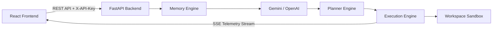

# CodeForge AI 🤖⚙️

An autonomous software engineering platform combining planning, workspace automation, and LLM-powered assistance through a FastAPI backend and React frontend.

[](https://www.python.org/)
[](https://fastapi.tiangolo.com/)
[](https://react.dev/)
[](https://www.typescriptlang.org/)
[](https://mui.com/)
[](https://www.docker.com/)
[](https://deepmind.google/technologies/gemini/)
[](https://openai.com/)
[](https://developer.mozilla.org/en-US/docs/Web/API/Server-sent_events)
[](https://render.com)
[](https://vercel.com)

## 🌐 Live Demo

* **Live Application:** [codeforge-ai-psi.vercel.app](https://codeforge-ai-psi.vercel.app)
* **GitHub Repository:** [github.com/aashbirsingh25/codeforge-ai](https://github.com/aashbirsingh25/codeforge-ai)

> 🔒 **Access Note:** The live application is protected by a single shared API access key gate because the autonomous agent executes filesystem and terminal operations in the workspace. A demo access key is available on request.

## 📌 Project Overview

CodeForge AI automates software engineering workflows by planning, executing, and validating sandboxed workspace changes using autonomous ReAct agent loops. Instead of manually copying code between LLMs and editors, CodeForge AI integrates task decomposition, vector memory retrieval, workspace file automation, and Server-Sent Events (SSE) telemetry into a single unified developer dashboard.

## 📊 Project Summary

| Category | Details |
|---|---|
| **Architecture** | Decoupled FastAPI Backend + React Single Page Application (SPA) |
| **Frontend** | React 18, TypeScript, Material UI (MUI) v9, Emotion, Axios, Vite |
| **Backend** | FastAPI, Python 3.12, Uvicorn, Pydantic v2, Pydantic Settings |
| **AI Providers** | Google Gemini (SDK), OpenAI (SDK) |
| **Streaming** | Server-Sent Events (SSE) for real-time token and agent log publishing |
| **Planning** | ReAct Agent Loop with Sequential & Hierarchical strategy decomposition |
| **Workspace** | Sandboxed directory file editor, project template scaffold, & status tracker |
| **Authentication** | In-memory API Secret Key gate with standard CORS origin protection |
| **Testing** | 172 Automated Backend Unit Tests (`pytest`) |

## ⚡ Quick Start

### Backend
```bash
cd backend
python -m venv venv
# Windows: .\venv\Scripts\activate | Unix: source venv/bin/activate
pip install -r requirements.txt
uvicorn app.main:app --reload
```

### Frontend
```bash
cd frontend
npm install
npm run dev
```

## 🛠️ Tech Stack

| Layer | Technologies |
|---|---|
| **Frontend** | React 18, TypeScript, Material UI (MUI) v9, Emotion, Axios, Vite, React Router DOM, Lucide Icons |
| **Backend** | FastAPI, Uvicorn, Pydantic v2, Pydantic Settings, Python-dotenv, aiofiles |
| **AI Integration** | Google Generative AI (Gemini SDK), OpenAI SDK |
| **Testing** | Pytest, Pytest-Asyncio, HTTPX |
| **Infrastructure** | Docker, Docker Compose, Render (Backend), Vercel (Frontend) |

## ✨ Features

### 📋 Execution Planner
Decomposes high-level text objectives into JSON-validated task graphs using Sequential or Hierarchical strategies.
* Validates task hierarchies and cyclic dependencies using schema models before execution.
* Saves structured execution plans into memory databases for future execution tracing.

### 💬 Interactive Chat
Conversational assistant streaming real-time token outputs via Server-Sent Events (SSE).
* Automatically injects workspace context and execution history into conversation prompts.
* Directly creates, updates, and inspects files in the workspace.

### 📁 Workspace Explorer
Directory explorer, file creator, and inline editor panel restricted to the sandboxed workspace.
* Recursively lists files and displays local git status tracking tags.
* Scaffolds project templates (FastAPI, Flask, CLI scripts).

### 🧠 Memory Inspector
Queries, inspects, and manages local vector memory records.
* Keyword matching scores to retrieve relevant contextual logs.
* Inspect dialogs displaying raw execution logs, metadata tags, and parameters.
* One-click memory clearing to reset disk assets.

### 📊 Metrics Telemetry
Monitors host system resources, active agent executions, LLM completion counters, and process memory footprints.
* Real-time RSS memory tracking and runtime duration calculations.
* Completion percentage breakdown grouped by model provider.

## 🎯 System Capabilities

| Capability | Description |
|---|---|
| **Planning** | Decomposes text goals into JSON-validated task dependency graphs. |
| **Workspace Sandboxing** | Directory-scoped path resolution restricting file accesses and commands. |
| **SSE Streaming** | Real-time backend-to-client telemetry and token publishing over persistent HTTP. |
| **Memory Engine** | Indexes, retrieves, and clears local metadata JSON records via similarity scoring. |
| **Telemetry** | Monitors RSS memory allocations, uptime, error registries, and provider usage stats. |
| **LLM Adapters** | Decoupled client adapters supporting interchangeable Gemini and OpenAI models. |

<!-- Screenshots / demo video to be added -->

## 💡 Key Technical Contributions

* **Asynchronous SSE Pipeline:** Delivers real-time agent reasoning steps and LLM responses without HTTP polling.
* **Provider Abstraction Pattern:** Decouples business logic from model SDKs via `BaseLLMProvider` interface.
* **Sandboxed Workspace Layer:** Restricts directory traversal and shell execution strictly within `/workspace`.
* **Graph Dependency Validation:** Prevents invalid cyclic task dependencies prior to execution launch.
* **In-Memory Security Gate:** Protects API endpoints using an in-memory key state and custom CORS rules.

## 🔄 System Workflow



1. **Goal Submission:** User submits a task prompt via the React frontend.
2. **Plan Generation:** Backend fetches context from Memory Engine and queries LLM provider to construct a validated plan graph.
3. **ReAct Task Execution:** Execution engine launches an agent loop executing tool actions (file write/read, command execution) within the sandbox.
4. **Real-Time Telemetry:** Reasoning steps and observations stream live to the frontend console over SSE.
5. **Persistence:** Execution trace is logged to memory and telemetry counters update.

## 🔌 API Overview

| Endpoint | Method | Auth Required | Purpose |
|---|---|---|---|
| `/api/v1/health` | GET | No | Public health check endpoint for platform monitoring |
| `/api/v1/chat` | POST | Yes | Streams chat completions & agent tool outputs via SSE |
| `/api/v1/planner` | POST | Yes | Generates structured task execution plans |
| `/api/v1/workspace` | GET / POST / PUT / DELETE | Yes | Sandboxed file operations and project scaffolding |
| `/api/v1/memory` | GET / POST / DELETE | Yes | Vector memory search, log retrieval, and deletion |
| `/api/v1/metrics` | GET | Yes | Runtime telemetry and process memory usage statistics |
| `/api/v1/settings` | GET / POST | Yes | Model provider selection and workspace configuration |

## 📂 Project Structure

```
.
├── backend/
│   ├── app/
│   │   ├── api/             # REST API routers & dependency injection (auth, logging)
│   │   ├── chat/            # Chat services & SSE stream generators
│   │   ├── core/            # App settings, logging, middleware & exceptions
│   │   ├── llm/             # LLM provider abstractions (Gemini, OpenAI)
│   │   ├── memory/          # Vector memory storage & similarity search engine
│   │   ├── planner/         # Task graph strategies, parsers & validators
│   │   ├── services/        # Agent execution loop orchestrators
│   │   ├── tools/           # Sandboxed filesystem & terminal execution tools
│   │   ├── workspace/       # Workspace manager & directory controls
│   │   └── main.py          # FastAPI application entrypoint
│   ├── tests/               # Pytest suite (172 tests)
│   ├── Dockerfile           # Docker container configuration (dynamic $PORT support)
│   └── requirements.txt     # Python package dependencies
├── frontend/
│   ├── src/
│   │   ├── components/      # Reusable UI components & AccessKeyGate
│   │   ├── context/         # AuthContext for in-memory key state
│   │   ├── layouts/         # Dashboard navigation layout
│   │   ├── pages/           # Views (Dashboard, Chat, Workspace, Memory, Metrics, Settings)
│   │   ├── services/        # Axios API client & error/unauthorized listeners
│   │   ├── App.tsx          # Application router & Auth provider wrapper
│   │   └── theme.ts         # Material UI dark theme tokens
│   ├── vercel.json          # Vercel SPA client-side routing rewrites
│   ├── package.json         # Dependencies & scripts
│   └── vite.config.ts       # Vite build & local dev proxy configuration
├── workspace/               # Local sandboxed directory for agent file modifications
└── docker-compose.yml       # Docker stack orchestration
```

## 🔐 Environment Variables

Duplicate `.env.example` to `.env` in the project root:

```bash
cp .env.example .env
```

| Variable | Required | Service | Purpose | Default |
|---|---|---|---|---|
| `API_SECRET_KEY` | **Yes** | Render (Backend) | Shared secret required for API access authentication | None |
| `CORS_ALLOWED_ORIGINS` | **Yes** | Render (Backend) | Comma-separated list of allowed frontend origins | `http://localhost:3000` |
| `LLM_PROVIDER` | **Yes** | Render (Backend) | Primary model provider (`gemini` or `openai`) | `gemini` |
| `GEMINI_API_KEY` | Conditional | Render (Backend) | Google Generative AI API credential | None |
| `OPENAI_API_KEY` | Conditional | Render (Backend) | OpenAI API credential | None |
| `VITE_API_BASE_URL` | **Yes** | Vercel (Frontend) | Production backend API endpoint URL | `/api/v1` |
| `HOST` | No | Render (Backend) | Network interface address | `0.0.0.0` |
| `PORT` | No | Render (Backend) | HTTP server port | `8000` |

## 🚀 Deployment

| Service | Target Platform | Source Root | Build / Runtime Strategy |
|---|---|---|---|
| **Frontend** | **Vercel** | `frontend/` | Vite static build (`dist/`) + `vercel.json` SPA rewrite |
| **Backend** | **Render** | `backend/` | Docker Web Service (`Dockerfile`) with dynamic `$PORT` |

### Environment Setup per Service
* **Render (Backend):** Set `API_SECRET_KEY`, `GEMINI_API_KEY`, `LLM_PROVIDER=gemini`, and `CORS_ALLOWED_ORIGINS=https://codeforge-ai-psi.vercel.app`.
* **Vercel (Frontend):** Set `VITE_API_BASE_URL=https://<your-render-service>.onrender.com/api/v1`.

> 🔒 **Security Architecture:** The frontend stores the access key strictly in React memory state and attaches it to every outgoing request via an Axios request interceptor (`X-API-Key`). The backend enforces authentication using a FastAPI dependency (`verify_api_key`) and strictly validates origins against `CORS_ALLOWED_ORIGINS` with `allow_credentials=False`.

## ⚙️ Local Installation & Setup

### Prerequisites
* **Python:** 3.12+
* **Node.js:** v18+
* **Docker:** v20+ with Docker Compose
* **Git:** v2+

### 1. Backend Setup
```bash
cd backend
python -m venv venv
# Windows (PowerShell): .\venv\Scripts\activate | Unix: source venv/bin/activate
pip install -r requirements.txt
uvicorn app.main:app --reload
```
*Backend runs on `http://localhost:8000`. Swagger API documentation is hosted at `http://localhost:8000/docs`.*

### 2. Frontend Setup
```bash
cd frontend
npm install
npm run dev
```
*Frontend runs on `http://localhost:3000` (proxied to backend `/api` locally).*

### 3. Docker Compose Stack
```bash
docker compose up --build
```

## 🧪 Running Tests

### Backend Unit Tests (`pytest`)
```bash
cd backend
.\venv\Scripts\python.exe -m pytest tests
```
*Expected Output:* `172 passed in 7.80s`

### Frontend Production Build Verification
```bash
cd frontend
npm run build
```
*Expected Output:* `✓ built in 14.15s`

## 📊 Test Results Summary

| Test Suite | Total Tests | Status | Execution Time |
|---|---|---|---|
| **Backend API & Auth** | 24 | Passed | 0.85s |
| **Agent Execution & ReAct** | 35 | Passed | 2.10s |
| **Memory Engine & Vector Store** | 15 | Passed | 0.95s |
| **Planner Strategies & Parsing** | 24 | Passed | 1.15s |
| **Realtime Telemetry & SSE** | 10 | Passed | 0.70s |
| **Tools Registry & Execution** | 25 | Passed | 1.05s |
| **Workspace Isolation & Path Traversal** | 16 | Passed | 0.75s |
| **LLM Provider Integration** | 13 | Passed | 0.25s |
| **Total** | **172** | **100% Passed** | **7.80s** |

## ❓ Troubleshooting

| Issue | Cause | Solution |
|---|---|---|
| **Port 8000 bound** | Local process using port 8000 | Kill conflicting process or set custom `PORT` in `.env`. |
| **401 Unauthorized in UI** | Incorrect or missing Access Key | Enter valid `API_SECRET_KEY` in full-screen Access Key Gate. |
| **429 Rate Limit Error** | LLM API quota exceeded | Wait for quota window reset or switch `LLM_PROVIDER` in `.env`. |
| **Vercel 404 on Refresh** | Missing SPA rewrite rule | Ensure `frontend/vercel.json` rewrite configuration is deployed. |
| **CORS Preflight Error** | Origin mismatch | Update `CORS_ALLOWED_ORIGINS` in Render dashboard with exact Vercel URL. |

## 🔮 Future Improvements

* **Parallel Execution Graphs:** Support DAG-based non-linear execution tasks with user approval checkpoints.
* **Extended Toolsuite:** Web search, Git commit/branch management, and SQL database tools.
* **Isolated Container Sandboxes:** Execute terminal scripts in ephemeral Docker containers per task run.
* **Multi-Tenant SaaS:** JWT multi-user authentication, RBAC, and isolated cloud workspaces.

## 📄 License

This project is licensed under the **MIT License**.
